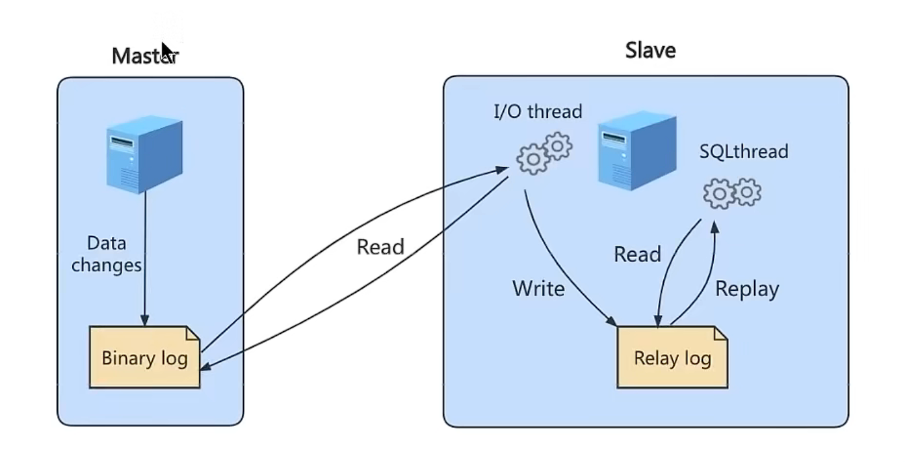
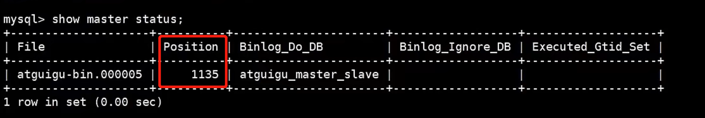
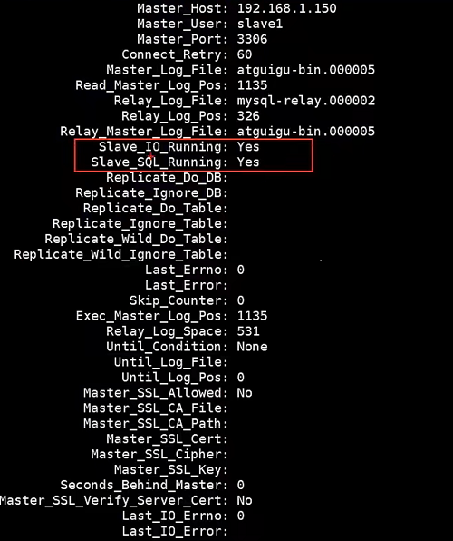
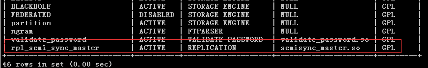

# SQL性能优化

## 1.sql级别[如何优化、解决、避免sql效率问题]

### 如何定位执行慢的SQL：慢查询

**面试官:** 你通常都是如何定位执行慢的sql的？

**我:** 通常要定位慢sql的话，一般我会开启**慢查询日志**<br/>
1. 可以查看数据库慢查询日志是否开启 命令: **slow variables like '%slow_query_log'**<br/>

命令: **slow variables like '%slow_query_log%'** 显示日志存储的位置。


此时是关闭的 打开命令: **set slow_query_log=on**
<br/>
2. 同时可以查看慢查询时间阈值 命令: **show variables like '%long_query_time'**

默认十秒中，设置时间命令: **set long_query_time=2**

3. 打开慢查询日志并设置好时间后，使用慢查询日志分析工具: **mysqldumpslow** 执行的话需要退出mysql环境。/data/LAPTOP-PVKIO0GI-slow.log 是存日志的路径。
**mysqldumpslow -s t -t 5 /data/LAPTOP-PVKIO0GI-slow.log**
::: note
-s: 是排序的意思  按照何种规则排序。
-t: 是返回几条的意思。
:::
<br/>

::: warning
开启慢查询日志会多少带来性能的影响，所以一般调优的时候才开启。
:::

### 平常如何查看是否使用到索引呢？

使用 **EXPLAIN/DECSRIBE**(两者效果一样) 这两个对sql进行分析。
::: note
使用后我们可以观察：<br/>
**key列:** 因为他是实际用到的索引值。<br/>
**type列:** 此列表示关联类型或访问类型。也就是MySQL决定如何查找表中的行。依次从最优到最差分别为：system > const > eq_ref > ref > range > index > all。
:::

### 避免索引失效，导致全盘扫描
1. 计算/函数/类型转换导致索引失效
2. 范围条件右边的列索引失效(联合索引时 碰到范围查询比如 > <>,右边那列索引失效)
3. 使用符号!=/<>索引失效。
4. 使用 is null索引生效，is not null 索引失效。
5. like 以通配符百分号%开头索引失效  比如(like '%aa')
6. OR 前后存在非索引列，索引失效。(必须保证前后都有索引)


## 2.数据库级别[数据库层面优化sql效率]


### binlog日志

1. **数据库中binlog日志有什么作用及应用场景？**

::: note
binlog日志即二进制日志文件，它记录了数据库所有执行 DDL,DML等数据库更新事件的语句。
但不包括查询(select)show语句。
:::
**应用场景**<br/>
* 用于 **数据恢复:** Mysql服务器意外的停止，可以通过二进制文件来查看有哪些操作对此恢复数据。
* 用于 **数据复制:** 用于主从复制方面。

对于Mysql数据库的数据备份,主从,主主,主备都离不开binlog，需要它同步数据。保证数据的一致。

2. **如何使用binlog日志**

* **SHOW BINARY LOGS:** 显示服务器现有的二进制日志信息。
* **flush logs:** flush刷新log日志，自此刻开始产生一个新编号的binlog日志文件。
* **show master status:** 即最后（最新）一个binlog日志的编号名称
* **reset master:** 重置（清空）所有binlog日志
* **purge master logs to '文件名':** 删除此文件之前的日志文件。
* 通过**show variables like '%log_bin%':** 命令查看binlog是否开启，若是没开启可以通过配置文件开启。
::: note
找到 mysql中**my.cnf** 配置文件配置一下内容<br/>
log-bin=xxx 日志文件名<br/>
binlog_expire_logs_seconds=60000 文件的保留时间<br/>
max_binlog_size=100M   文件上限大小,默认1GB<br/>
配置完成后 **service mysqld restart** 重启。
:::

* **如何查看binlog日志内容？**

```
  1. 通过 mysqlbinlog -v '日志文件路径' 命令查看。
  2. 通过以上命令读取的内容比较多 不利于查看不容易分辨。我们可以通过命令:
  show binlog events [IN 'log_name'] [FROM pos] [LIMIT [offset,] row_count];查看
```
  * **IN 'log_name'**: 指定查询的binlog文件名(不指定就是第一个binlog文件)
  * **FROM pos**: 指定从哪个pos起始点查(不指定就是从整个文件pos点开始算)
  * **LIMIT [offset]**: 偏移量。
  * **row_count**: 查询总条数。
  如下图所示  我们根据 show binlog 命令查出信息:
  
  如上图所示: 知道开始的 pos和结束的pos。我们通过命令:<br/>
  * **数据恢复命令**
  **mysqlbinlog --start-position=开始的pos --stop-position=结束的pos --database=要操作的数据库 binlog的名称 | mysql -u登陆名 -p登陆密码 -v 要操作的数据库**

  * **最终执行命令(我的)**
  **mysqlbinlog --start-position=560 --stop-position=771 --database=my_test binlog.000033 | mysql -uroot -p123456 -v my_test**
  ::: warning
  此命令进入到 binlog 目录下执行，而不是在mysql中。列如: cd /var/lib/mysql
  :::

  ### 主从复制层面优化性能

* 主从复制原理
  从机(slave)读取主机(master)binlig日志来同步数据。那主要靠着以下三个线程。
  * **二进制日志转储线程(Binlog dump thread):** 它是一个主库线程，当从库线程连接的时候，主库可以将二进制日志发送给从库，当主库读取时间(Event) 的时候，会在binlog枷锁，读取完成之后在将锁释放掉。
  * **从库I/O线程:** 会连接到主库,向主库发动请求更新binlog。这时从库的I/O线程就可以读取到主库二进制日志转储线程发送的Binlog更新部分，并且拷贝到本地的中继日志(Relay log)。
  * **从库 sql 线程:** 会读取从库中的中继日志，并且执行日志中的事件，将从库的数据与主库保持同步。 

**总结:** 二进制日志转储线程 发送二进制日志(binlog)到从机(slave)。从机从库I/O线程接收并写入到中继日志(Relay log)。然后从库 sql 线程会对中继日志读取。以至于保持从库与主库数据保持一致。

* **主从复制搭建**
  * **Master主机配置**
    * my.cnf 配置文件 配置一下属性:<br/>
      | 属性 | 描述 |
      | ---- | ---- |
      | server-id | 主服务器唯一标识 列如: server-id=1 **必选参数**|
      | log-bin | 启用二进制日志，指名路径 **必选参数** 
      | read-only |  0表示读写(主机) 1表示只读(从机) **可选参数**|
      | binlog_expire_logs_seconds | 日志文件保留的时长 单位秒 **可选参数**| 
      | max_binlog_size | 二进制日志大小 此参数最大默认值时1GB **可选参数**|
      | binlog-ignore-db| 不要复制的数据库**可选参数** | 
      | binlog-do-db | 需要复制的数据库 **可选参数**|
      | binlog_format | binlog格式 列如: binlig_format=STATEMENT **可选参数**| 
       配置完后重启主机服务 **systemctl restart mysqld**
    * **主机建立账户并授权**
      ::: warning
      如果是Mysql8 执行以下命令语句:<br/>
      **CREATE USER 'slave'@'%' IDENTIFIED BY '123456';**<br/>
      **GRANT REPLICACTION SLAVE  ON  *.* TO 'slave'@'%';**<br/>
      **ALTER USER 'slave'@'%' IDENTIFIED WITH  mysql_native_password BY '123456';**
      :::
      ::: warning
      如果是Mysql5/7 执行以下命令语句:<br/>
      **GRANT REPLICACTION SLAVE  ON  *.* TO 'slave'@'从机数据库Ip' IDENTIFIED BY '123456';**
      :::
      **执行完之后刷新权限: flush privileges;**
  ::: tip
    在主机刷新权限后: 执行**show master status**记录其中position的值
    
  :::
  * **Slave从机配置**  
    * 执行语句:<br/> 
    **CHANGE MASTER TO MASTER_HOST='主机IP地址' MASTER_USER='主机用户名' MASTER_PASSWORD='主机用户名的密码' MASTER_LOG_FILE='日志文件名' MASTER_LOG_POS=具体position的值(就是 show master status后的position值)**
    * 执行语句 **start slave;** 启动slave同步
    * 执行语句 **show slave status\G;** 如下图红框内 出现yes则成功。
    

* **如何保证数据一致性?**
  ```
    虽然我们搭建了主从复制，但是我们要考虑如何保持数据的一致性(也就是主机和从机的数据保持一致)。
  ```
  * 异步复制:<br/>
  &emsp;&emsp;Mysql中默认。在主库完成写入binlog日志中提交完事务后，就返回客户端。不用等待从库返回结果。那这样不会影响到主库的写入的效率，但是一旦主库宕机，从库这时还没收到binlog日志。那么造成数据丢失。
  * 半同步复制: <br/>
  &emsp;&emsp;在异步复制时主库提交完事务后返回了客户端，而半同步复制还是转发到从库然后一系列的从库执行。当有从库执行完后会ACK
  通知主库。这样保证了数据的一致性。但是！！注意这句话 当有从库执行完后，也就是说从库不止一台。那不能就一台从库完成了然后ack通知一下 那其他的还没执行。所以在Mysql5.7版本中增加一个**rpl_semi_sync_master_wait_for_slave_count**参数。可以对应答数量控制。
  不过显而易见 效率上也会受到影响。
    * **半同步复制如何开启呢？**
      * 在主机,从机安装半同步的插件 在mysql中执行 **install plugin rpl_semi_sync_master soname ‘semisync_master.so’;**
      * 启动半同步: **set global rpl_semi_sync_master_enabled=on;**
      * **show plugins;** 查看插件是否成功。如下图: 
      
      * **stop slave io_thread; start slave io_thread;** 重启I/o线程
    ::: note
     **如果需要开启启动半同步状态需要将如下参数写入配置文件**<br/>
     rpl_semi_sync_slave_enabled=on;<br/>
     rpl_semi_sync_master_enabled=on;<br/>
     **重要参数变量说明**<br/>
     Rpl_semi_sync_master_no_tx 代表没有成功接收slave提交的次数<br/>
     Rpl_semi_sync_master_yes_tx 代表成功接收slave事务回复的次数<br/>
     rpl_semi_sync_master_timeout参数默认为10s，即主库在超过10s未收到从库的回复会自动切换为异步模式。为了保障数据的安全性，可 以将该参数值调大。<br/>
     主库Rpl_semi_sync_master_status=off表示半同步复制停止，如果需要从异步复制模式恢复为半同步复制模式，只需要在从库重新开启I/O thread，命令：start slave io_thread
    :::
     
  ### 读写分离有哪些实现方式？
    对于读写分离前提就是主从复制。在一些并发，优化层面等场景读写分离又可以将效率提升一节儿。那么读写分离如何实现呢？
    具体的实现细节就不多讲了，后续会推送到公众号可以前去搜索查看。

    1. **配置多个数据源:** <br/>
    基于spring/springboot 我们配置多个数据源，在业务逻辑层面根据情况来分开使用。
    同时我们可以使用**AbstractRoutingDataSource和自定义注解**方式，更为方便的实现读写分离。
    2. **基于MySQL proxy代理的方式**<br/>
    在应用和数据库之间增加代理层，代理层接收应用对数据库的请求，根据不同请求类型转发到不同的实例，在实现读写分离的同时可以实现负载均衡。
    ::: note
    MySQL的代理最常见的是mysql-proxy、cobar、mycat、Atlas等。这种方式对于应用来说，MySQL Proxy是完全透明的，应用则只需要连接到MySQL Proxy的监听端口即可。当然，这样proxy机器可能成为单点失效，但完全可以使用多个proxy机器做为冗余，在应用服务器的连接池配置中配置到多 个proxy的连接参数即可。
    :::
    * mysql-proxy是一个轻量的中间代理，是官方提供的mysql中间件产品可以实现负载平衡，读写分离，failover等，依靠内部一个lua脚本实现读写语句的判断。项目地址： https://github.com/mysql/mysql-proxy ，该项目已经六七年没有维护了，官方也不建议应用于生成环境。
    * cobar是阿里提供的一个中间件，已经停止更新。项目地址：https://github.com/alibaba/cobar 
    * mycat的前身就是cobar，活跃度比较高，完全使用java语言开发。 项目地址：https://github.com/MyCATApache/Mycat-Server ，该项目当前已经有8.3k的点赞量。
    * moeba（变形虫）是阿里工程师陈思儒基于java开发的一款数据库读写分离的项目(读写分离只是它的一个小功能)，与MySQL官方的MySQL Proxy相比，作者强调的是amoeba配置的方便（基于XML的配置文件，用SQLJEP语法书写规则，比基于lua脚本的MySQL Proxy简单）。更多详细介绍请参考：https://www.biaodianfu.com/amoeba.html , 下载地址：https://sourceforge.net/projects/amoeba/ 。
    * Atlas奇虎360的一个开源中间代理，是在mysql官方mysql-proxy 0.8.2的基础上进行了优化，增加一些新的功能特性。 项目地址: https://github.com/Qihoo360/Atlas ，该项目当前已经有4.4k的点赞量。
    3. **基于sharding-jdbc的方式**<br/>
    sharding-sphere是强大的读写分离、分表分库中间件，sharding-jdbc是sharding-sphere的核心模块。


