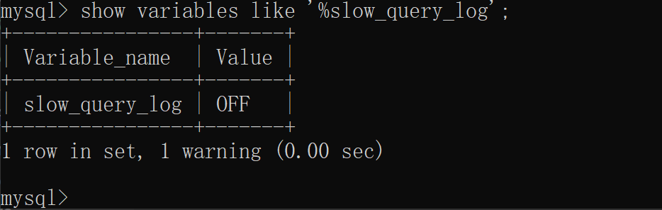
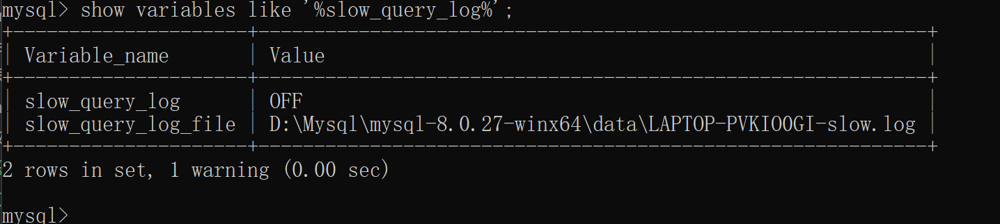
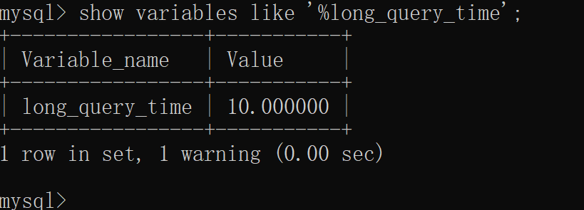
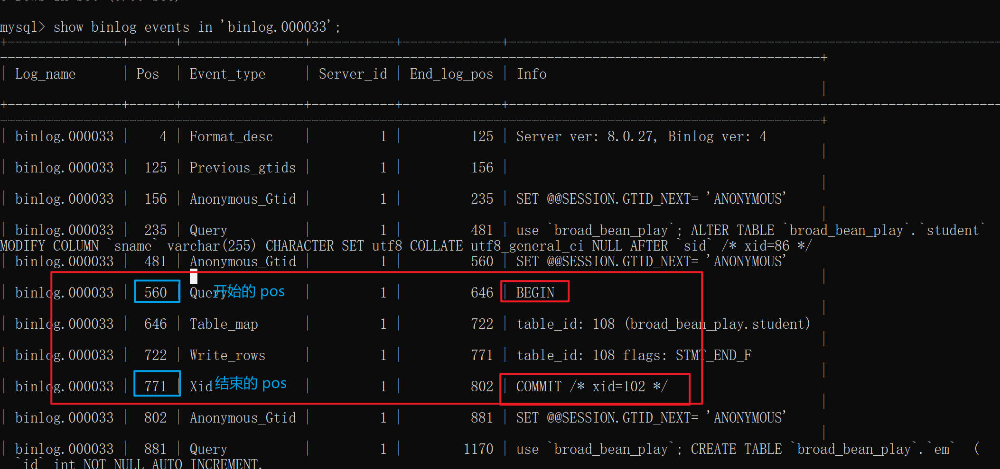

# SQL性能优化

## sql级别[如何优化、解决、避免sql效率问题]

### 如何定位执行慢的SQL：慢查询

**面试官:** 你通常都是如何定位执行慢的sql的？

**我:** 通常要定位慢sql的话，一般我会开启**慢查询日志**<br/>
1. 可以查看数据库慢查询日志是否开启 命令: **slow variables like '%slow_query_log'**<br/>

命令: **slow variables like '%slow_query_log%'** 显示日志存储的位置。


此时是关闭的 打开命令: **set slow_query_log=on**
<br/>
2. 同时可以查看慢查询时间阈值 命令: **show variables like '%long_query_time'**

默认十秒中，设置时间命令: **set long_query_time=2**

3. 打开慢查询日志并设置好时间后，使用慢查询日志分析工具: **mysqldumpslow** 执行的话需要退出mysql环境。/data/LAPTOP-PVKIO0GI-slow.log 是存日志的路径。
**mysqldumpslow -s t -t 5 /data/LAPTOP-PVKIO0GI-slow.log**
::: note
-s: 是排序的意思  按照何种规则排序。
-t: 是返回几条的意思。
:::
<br/>

::: warning
开启慢查询日志会多少带来性能的影响，所以一般调优的时候才开启。
:::

### 平常如何查看是否使用到索引呢？

使用 **EXPLAIN/DECSRIBE**(两者效果一样) 这两个对sql进行分析。
::: note
使用后我们可以观察：<br/>
**key列:** 因为他是实际用到的索引值。<br/>
**type列:** 此列表示关联类型或访问类型。也就是MySQL决定如何查找表中的行。依次从最优到最差分别为：system > const > eq_ref > ref > range > index > all。
:::

### 避免索引失效，导致全盘扫描
1. 计算/函数/类型转换导致索引失效
2. 范围条件右边的列索引失效(联合索引时 碰到范围查询比如 > <>,右边那列索引失效)
3. 使用符号!=/<>索引失效。
4. 使用 is null索引生效，is not null 索引失效。
5. like 以通配符百分号%开头索引失效  比如(like '%aa')
6. OR 前后存在非索引列，索引失效。(必须保证前后都有索引)


## 数据库级别[数据库层面优化sql效率]


### binlog日志

1. **数据库中binlog日志有什么作用及应用场景？**
::: note
binlog日志即二进制日志文件，它记录了数据库所有执行 DDL,DML等数据库更新事件的语句。
但不包括查询(select)show语句。
:::
**应用场景**<br/>
* 用于 **数据恢复:** Mysql服务器意外的停止，可以通过二进制文件来查看有哪些操作对此恢复数据。
* 用于 **数据复制:** 用于主从复制方面。

对于Mysql数据库的数据备份,主从,主主,主备都离不开binlog，需要它同步数据。保证数据的一致。

2. **如何使用binlog日志**
* **SHOW BINARY LOGS** 显示服务器现有的二进制日志信息。
* flush刷新log日志，自此刻开始产生一个新编号的binlog日志文件(flush binlog)。
* 通过**show variables like '%log_bin%'** 命令查看binlog是否开启，若是没开启可以通过配置文件开启。
::: note
找到 mysql中**my.cnf** 配置文件配置一下内容<br/>
log-bin=xxx 日志文件名<br/>
binlog_expire_logs_seconds=60000 文件的保留时间<br/>
max_binlog_size=100M   文件上限大小,默认1GB<br/>
配置完成后 **service mysqld restart** 重启。
:::
* 如何查看日志内容？

```
  1. 通过 mysqlbinlog -v '日志文件路径' 命令查看。
  2. 通过以上命令读取的内容比较多 不利于查看不容易分辨。我们可以通过命令:
  show binlog events [IN 'log_name'] [FROM pos] [LIMIT [offset,] row_count];查看
```
  * **IN 'log_name'**: 指定查询的binlog文件名(不指定就是第一个binlog文件)
  * **FROM pos**: 指定从哪个pos起始点查(不指定就是从整个文件pos点开始算)
  * **LIMIT [offset]**: 偏移量。
  * **row_count**: 查询总条数。
  如下图所示  我们根据 show binlog 命令查出信息:
  
  如上图所示: 知道开始的 pos和结束的pos。我们通过命令:<br/>
  * **数据恢复命令**
  **mysqlbinlog --start-position=开始的pos --stop-position=结束的pos --database=要操作的数据库 binlog的名称 | mysql -u登陆名 -p登陆密码 -v 要操作的数据库**

  * **最终执行命令(我的)**
  **mysqlbinlog --start-position=560 --stop-position=771 --database=my_test binlog.000033 | mysql -uroot -p123456 -v my_test**
  ::: warning
  此命令进入到 binlog 目录下执行，而不是在mysql中。列如: cd /var/lib/mysql
  :::


