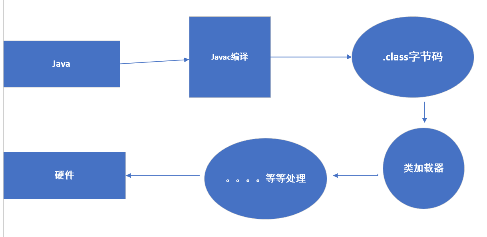

# 关于java中一些基础面试题

## 基础概念
### JVM && JDK && JRE
#### JVM
::: tip JVM
* java 虚拟机 (JVM) 是运行java字节码的虚拟机。是一种用于计算设备的规范，它是一个虚构出来的计算机，引入JVM后，Java语言在不同平台上运行时不需要重新编译。JVM是Java跨平台的核心。
* JVM是Java编程语言的核心。当我们运行一个程序时，JVM负责将字节码转换为特定机器代码。JVM也是平台特定的，并提供核心的Java方法，例如内存管理、垃圾回收和安全机制等。JVM 是可定制化的，我们可以通过Java 选项(java options)定制它，比如配置JVM 内存的上下界。JVM之所以被称为虚拟的是因为它提供了一个不依赖于底层操作系统和机器硬件的接口。
:::

#### JDK
::: tip JDK
* JDK 是 Java Development Kit 缩写，它是功能齐全的 Java SDK。它拥有 JRE 所拥有的一切，还有编译器（javac）和工具（如 javadoc 和 jdb）。它能够创建和编译程序。
* Java开发工具包是Java环境的核心组件，并提供编译、调试和运行一个Java程序所需的所有工具，可执行文件和二进制文件。JDK是一个平台特定的软件，有针对Windows，Mac和Unix系统的不同的安装包。可以说JDK是JRE的超集，它包含了JRE的Java编译器，调试器和核心类。
:::
#### JRE
::: tip JRE
* JRE（Java Runtime Environment）是一个安装包，它提供了一个环境，只在你的机器上运行（而不是开发） java程序（或应用程序）。JRE 仅供那些只想运行作为系统最终用户的 Java 程序的人使用。
* JRE 是 Java 运行时环境。它是运行已编译 Java 程序所需的所有内容的集合，包括 Java 虚拟机（JVM），Java 类库，java 命令和其他的一些基础构件。但是，它不能用于创建新程序
:::

### 字节码是什么？
::: tip 字节码
* 咱们常说的文件以.class为后缀的就是字节码文件，通常我们写的java程序文件.java。通过编译后变为.class文件。而这个字节码文件(.class)只能jvm去识别，换句话说只面向虚拟机。<a href="https://baike.baidu.com/item/%E8%99%9A%E6%8B%9F%E6%9C%BA/104440?fr=aladdin">虚拟机(jvm)</a>内部在对字节码文件去处理识别最终运行展现。 
* 字节码（Byte-code）是一种包含执行程序，由一序列 op 代码/数据对组成的二进制文件，是一种中间码。字节是电脑里的数据量单位。
**如下图简简略图**

:::

## 基础语法
### 注释有几种方式?
::: tip 注释
java 注释有三种方式:
* 单行注释
* 多行注释
* 文档注释
在我们编写代码是应该写明白注释，这对于后期维护，后期别人接手，自己回炉有很大的帮助。
:::
### java关键字有哪些？
|  分类   | 关键字  |
|  ----  | ----  |
| 访问控制  | private,public, protected| 
| 类，方法和变量修饰符 |	abstract,class,extends, final, implements, interface, native |
|程序控制	| break ,continue,return, do,	while	,if ,else |
| 错误处理 |	try, catch, throw ,throws	,finally |
| 基本类型|	boolean,byte,char,double,float,int	,long ,short |
| 保留字	| goto ,const	|
		
### ++/-- 自增自减
::: tip 自增自减
++ 和 -- 运算符可以放在变量之前，也可以放在变量之后，当运算符放在变量之前时(前缀)，先自增/减，再赋值；当运算符放在变量之后时(后缀)，先赋值，再自增/减。例如，当 b = ++a 时，先自增（自己增加 1），再赋值（赋值给 b）；当 b = a++ 时，先赋值(赋值给 b)，再自增（自己增加 1）。也就是，++a 输出的是 a+1 的值，a++输出的是 a 值。用一句口诀就是：“符号在前就先加/减，符号在后就后加/减”。
:::
## 基本数据类型
### java有几种基本数据类型?
::: tip 基本数据类型
java中有8种基本数据类型。
* 6 种数字类型：
1. 4 种整数型：byte、short、int、long
2. 2 种浮点型：float、double
* 1 种字符类型：char
* 1 种布尔型：boolean
:::
* 8中基本类型默认值及所占空间

| 基本类型	| 位数	| 字节	| 默认值	| 取值范围 |
|  ----  | ----  |  ----  | ----  | ----  |
|byte	 | 8	| 1	| 0	| -128 ~ 127 |
| short	| 16	| 2	| 0	| -32768 ~ 32767 |
| int	| 32	| 4	| 0	| -2147483648 ~  2147483647|
|long	| 64	| 8	| 0L |	-9223372036854775808 ~ 9223372036854775807 |
|char	| 16	| 2	| 'u0000'	| 0 ~ 65535 |
|float	| 32	| 4	| 0f	| 1.4E-45 ~ 3.4028235E38 | 
|double	| 64	| 8	| 0d	| 4.9E-324 ~ 1.7976931348623157E308 |
|boolean	| 1		| false	| true | false |

这八种基本类型都有对应的包装类分别为：Byte、Short、Integer、Long、Float、Double、Character、Boolean
### 基本类型和包装类的区别
* 包装类型不赋值就是 null ，而基本类型有默认值且不是 null。
* 包装类型可用于泛型，而基本类型不可以。
* 基本数据类型的局部变量存放在 Java 虚拟机栈中的局部变量表中，基本数据类型的成员变量（未被 static 修饰 ）存放在 Java 虚拟机的堆中。包装类型属于对象类型，我们知道几乎所有对象实例都存在于堆中。
* 相比于对象类型， 基本数据类型占用的空间非常小。
### 自动装箱与拆箱了解吗？

* 装箱：将基本类型用它们对应的引用类型包装起来；
* 拆箱：将包装类型转换为基本数据类型； 
举例：
~~~java
Integer i = 10;  //装箱
int n = i;   //拆箱
~~~

## 参考
<a href="https://snailclimb.gitee.io/javaguide/#/docs/java/basis/java-basic-questions-01?id=%e5%9f%ba%e7%a1%80%e6%a6%82%e5%bf%b5%e4%b8%8e%e5%b8%b8%e8%af%86">https://snailclimb.gitee.io/javaguide/#/docs/java/basis/java-basic-questions-01?id=%e5%9f%ba%e7%a1%80%e6%a6%82%e5%bf%b5%e4%b8%8e%e5%b8%b8%e8%af%86</a>