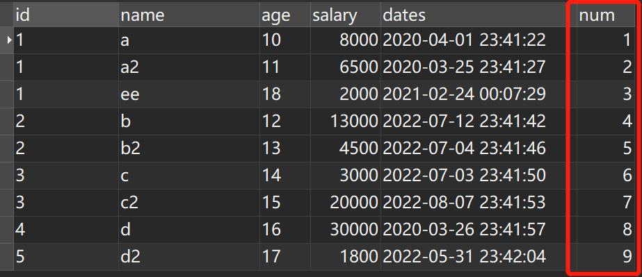
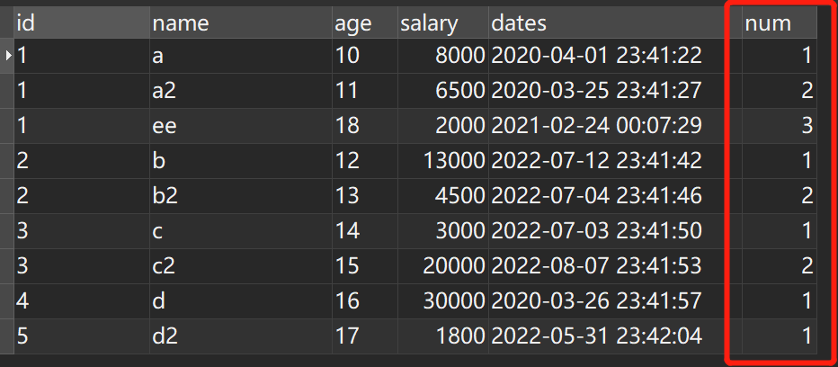
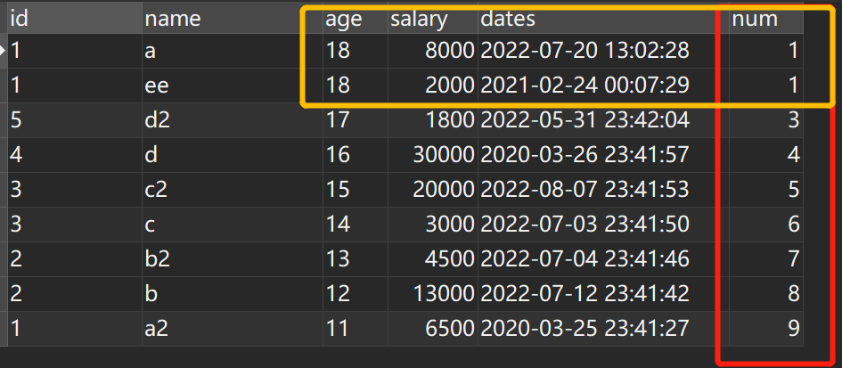

## ROW_NUMBER() OVER()
> 用于给数据库表中的记录进行标号，在使用的时候，其后还跟着一个函数 over()，而函数 over() 的作用是将表中的记录进行分组和排序。两者使用的语法为: 
**ROW_NUMBER() OVER(PARTITION BY COLUMN1 ORDER BY COLUMN2)**

* PARTITION BY: 表示分组
* ORDER BY: 表示排序

### 例子
* **order by**
~~~java
SELECT *,row_number() over(ORDER BY id) as num FROM `test_row_number_over`
~~~

由上图看到，我们根据id进行排序 生成了 num 的排序序号。

* **partition by**
~~~java
SELECT *,row_number() over(PARTITION by id  ORDER BY age) as num FROM `test_row_number_over`
~~~

当我们给id 加了 partition by分组后，num值变化如上图。相同的id 会按照顺序排列。不同的id会重新排列序号。

::: warning
row_number() over() 执行要晚于 where、group by等。
:::

## RANK() OVER()
> 用于给数据库表中的记录进行标号，在使用的时候，其后还跟着一个函数 over()，而函数 over() 的作用是将表中的记录进行分组和排序。两者使用的语法为: 
**RANK() OVER(PARTITION BY COLUMN1 ORDER BY COLUMN2)**

* PARTITION BY: 表示分组
* ORDER BY: 表示排序

### 例子
~~~java
SELECT *,RANK() over(ORDER BY age desc) as num FROM `test_row_number_over`
~~~

由上图看到，我们根据age进行排序 生成了 num 序号。但是age中有两个18岁的那生成的num序号就是并列的。然而到下一条数据的时候
会跳过并列值的下一个值。也就是图中前两条是1第三条就是三。跳过了2这个序号。

