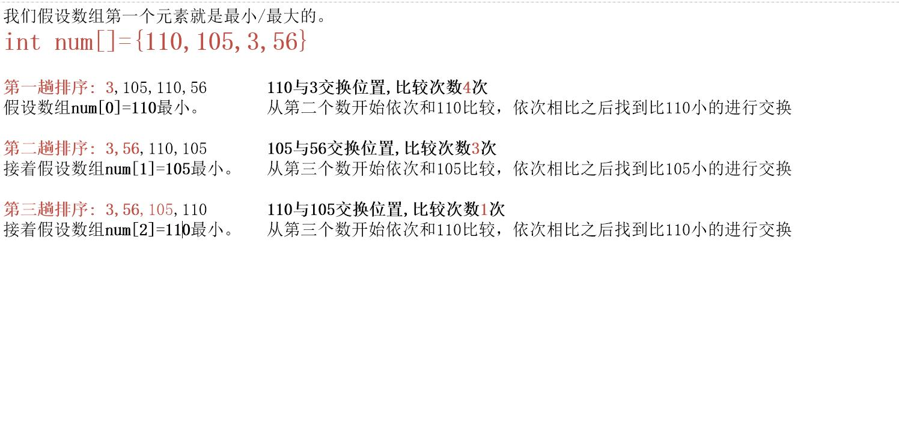

## 选择排序

### 选择排序思想
::: tip 思想
假设一个最小值n，我们这里假设arr[0]最小，让arr[n-1]与arr[n-1]后的数据与此比较，
第二次我们假设arr[n-1]最小，让arr[n-2]与arr[n-2]后的数据与此依次比较。
依次类推。
:::

### 选择排序推理
> 现给定一个数组 **int num[] = {110,105,3,56}**
#### 推理图

#### 规律总结
* 趟数(轮数)
由上图可知我们的数组有四个元素，那一共的趟数也就是 4-1=3 一共是三趟。 
那我们元素有n个，那躺数就是 n-1。
* 交换次数 
第一轮：元素个数4-1=三次 
第二轮：元素个数4-2=两次 
第三轮：元素个数4-3=一次 

**交换次数=3+2+1 = 6 = (n - 1) + (n - 2) + ... + 2 + 1 = n * (n - 1) / 2** 

### 代码实现
~~~java
int num[]={110,105,3,56};

//临时存储值
int temp=0;
//外层循环控制趟数  也就是 4-1趟
for(int i=0;i<num.length-1;i++){
    //假设i=0这个下标就是最小的。我们将其记下。
    int min=i;
    for(j=i+1;j<num.length;j++){
        //如果说第一个假设的n元素 要比n-1元素要大，交换
        if(num[min]>num[j]){
            min=j;
        }
    }
    //控制交换测试，若是最小下标min和i相等说明不存在交换。就不进行交换。
    if(min!=i){
        temp=num[i];
        num[i]=num[min];
        num[min]=temp;
    }
}
我是以下标为例。在一些时候 int min=num[0] 可以将第一个值给min 一个道理。
~~~

### 时间复杂度
> **时间复杂度就是平方阶:O(n^2)**
### 空间复杂度
> **空间复杂度就是:O(1)**

### 稳定性
选择排序属于不稳定的排序

::: warning
对于冒泡排序来说，简单选择的交换次数要比冒泡的少。所以性能方面也要比冒泡优越一点。
:::
