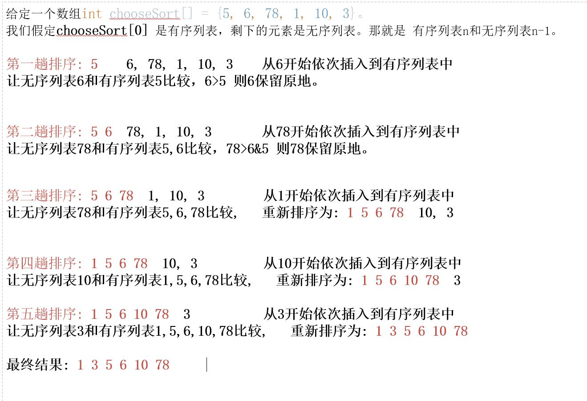

## 插入排序

### 插入排序法思想
::: tip 思想
n个待排序的元素看成为一个有序表和一个无序表，开始时有序列表中包含一个元素，
无序表中包含n-1个元素，排序过程中每次从无序表中取出第一个元素，把它的排序码依次与有序表元素的排序码进行比较。将它插入到有序表中的适当位置。成为新的有序表。
:::

### 插入排序推理
> 现给定一个数组 **int chooseSort[] = {5, 6, 78, 1, 10, 3}**
#### 推理图

#### 规律总结
* 趟数(轮数)
由上图可知我们的数组有六个元素，那一共的趟数也就是 6-1=3 一共是五趟。 
那我们元素有n个，那躺数就是 n-1。
* 交换次数 
**交换次数(n - 1) + (n - 2) + ... + 2 + 1 = n * (n - 1) / 2** 

### 代码1实现
~~~java
int a[]={5, 6, 78, 1, 10, 3}
//循环的趟数
for (int i=0;i<a.length-1;i++){
    //设有序列表
    int sort=i;
    //待插入值
    int next=a[i+1];
    //控制从无序列表依次插入，待插入的值要小于/大于 n-1的值
    for (int j=i+1;j>0 && next<a[sort] ;j--){
        a[j]=a[sort];
        sort--;
    }
    //控制移动元素的次数
    if(sort!=i){
        a[sort+1]=next;
    }
}
~~~
### 代码2实现
~~~java
        for(int i=0;i<a.length-1;i++){

            //定义为 有序列表
            int sort=i;
            //记录待插入的值
            int next=a[i+1];
            while (sort >= 0 && next < a[sort]){
                a[sort+1]=a[sort];
                sort--;
            }

            if(sort!=i){
                a[sort+1]=next;
            }
        }
~~~

### 时间复杂度
> **最坏的情况时间复杂度就是平方阶:O(n^2)**
> **最优的情况时间复杂度就是线性阶: O(n)**

### 空间复杂度
> **空间复杂度就是:O(1)**

### 稳定性
插入排序属于稳定的排序

### 使用场景
插入排序根据排序思想可得知，在已知有序列表，将无序列表插入有序列表之中的场景比较适合。根据时间复杂度来说
大数据量下性能有点拉胯的。
