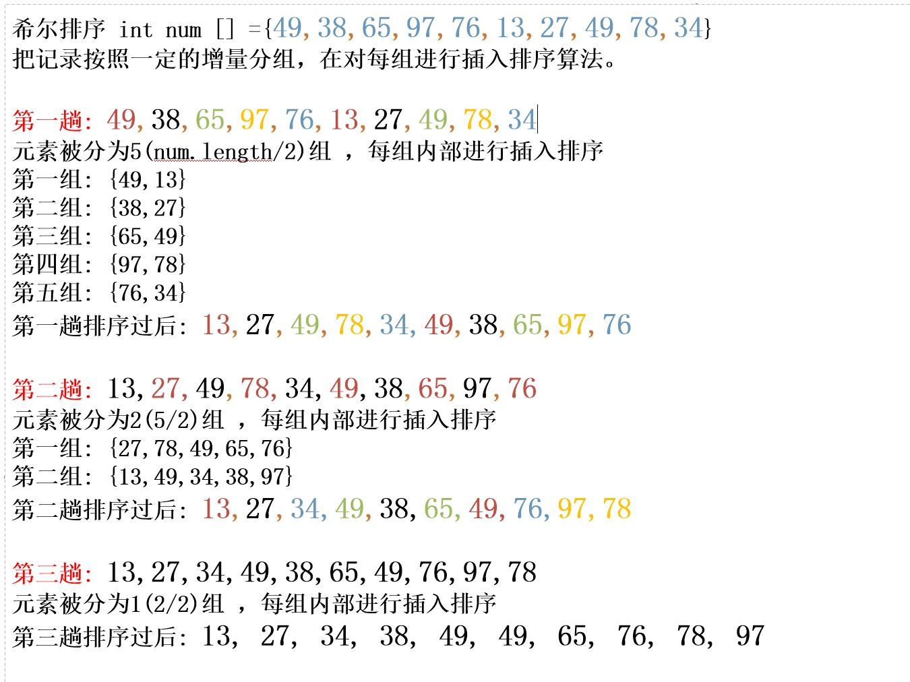

## 希尔排序

### 选择排序思想
希尔排序是插入排序的改进高效版，也称为缩小增量排序。
希尔排序是把记录按下标的一定增量分组，对每组内部使用直接插入排序算法排序；随着增量逐渐减少，每组包含的关键词越来越多，当增量减至1时，整个文件恰被分成一组，算法便终止。

### 希尔排序推理
> 现给定一个数组 **int[] arr={49,38,65,97,76,13,27,49,78,34}**
#### 推理图

### 代码1实现
~~~java
int a[]={5, 6, 78, 1, 10, 3}
//循环的趟数
for (int i=0;i<a.length-1;i++){
    //设有序列表
    int sort=i;
    //待插入值
    int next=a[i+1];
    //控制从无序列表依次插入，待插入的值要小于/大于 n-1的值
    for (int j=i+1;j>0 && next<a[sort] ;j--){
        a[j]=a[sort];
        sort--;
    }
    //控制移动元素的次数
    if(sort!=i){
        a[sort+1]=next;
    }
}
~~~

### 代码实现(交换法)

#### 代码推导实现
~~~java
public static void main(String[] args) {
        int[] arr={49,38,65,97,76,13,27,49,78,34};
        shell(arr);
    }
    public static void shell(int[] arr){
        //第一轮
        int temp=0;
        //arr.length/2=5  外层循环控制组，由此可见分为了五组
        for (int i=5;i< arr.length;i++){
            //遍历各组内的所有元素
            for (int j=i-5;j>=0;j=j-5){
                if (arr[j]>arr[j+5]){
                    temp=arr[j];
                    arr[j]=arr[j+5];
                    arr[j+5]=temp;
                }
            }
        }
        System.out.println("排序后的数据：");
        System.out.println(Arrays.toString(arr));

        //第二轮
        for (int i=2;i< arr.length;i++){
            for (int j=i-2;j>=0;j=j-2){
                if (arr[j]>arr[j+2]){
                    temp=arr[j];
                    arr[j]=arr[j+2];
                    arr[j+2]=temp;
                }
            }
        }
        System.out.println("排序后的数据：");
        System.out.println(Arrays.toString(arr));

        //第三轮
        for (int i=1;i< arr.length;i++){
            for (int j=i-1;j>=0;j=j-1){
                if (arr[j]>arr[j+1]){
                    temp=arr[j];
                    arr[j]=arr[j+1];
                    arr[j+1]=temp;
                }
            }
        }
        System.out.println("排序后的数据：");
        System.out.println(Arrays.toString(arr));
    }

    //返回数据
    //第一趟排序后的数据：
    [13, 27, 49, 78, 34, 49, 38, 65, 97, 76]
    //第二趟排序后的数据：
    [13, 27, 34, 49, 38, 65, 49, 76, 97, 78]
    //第三趟排序后的数据：
    [13, 27, 34, 38, 49, 49, 65, 76, 78, 97]
~~~
### 交换法
~~~java
    int[] arr={49,38,65,97,76,13,27,49,78,34};

    /**
    *根据上述推导代码,组的个数在变化。而第一次组的个数是通过数组元素/2得到。那当组数等于1的时候
    *我们就不在分组，而每次分组都是 依次对上一组的组数/2
    **/

    // 我们第一个循环控制组数,第一次组数是arr.length/2，组数要大于0 每次对上一组的组数/2得到下一组。
    int temp=0;
    for(int gap=arr.length/2;gap>0;gap=gap/2){
        //第二个for循环组
        for(int i=gap;i<arr.length;i++){
            //循环组内元素进行比较，j=j-gap控制就是要组内元素比较。
            /*举个例子:
            第一次分组是五组，拿、那第五组是76,34。根据arr数组元素34是下标9。
            我们套入循环 i=9,j就等于4，下标4就是76。j=j-gap这个等于-1不满足循环条件
            那其实我们第一趟 五组已经比较完成了。
            */
            for(int j=i-gap;j>=0;j=j-gap){
                if(arr[i]<arr[j]){
                    temp=arr[j];
                    arr[j]=arr[i];
                    arr[i]=temp;
                }
            }
        }
    }
    //最终结果
    排序后的数据：
    [13, 27, 34, 38, 49, 49, 65, 76, 78, 97]
~~~

### 移位法
~~~java
    //移位法要比交换法的性能优越，对于交换法来说交换次数拉胯了整个效率。
    //对于移位法来说，交换次数更少。
   for (int gap = arr.length/2;gap>0;gap/=2){
            for (int i = gap; i < arr.length; i++) {
                int j=i;
                int temp = arr[j];
                if (arr[j]<arr[j-gap]){
                    while(j-gap>=0 && temp<arr[j-gap]){
                        arr[j] = arr[j-gap];
                        j -= gap;
                    }
                    arr[j] = temp;
                }
            }
        }
~~~

### 时间复杂度
> **希尔排序时间复杂度就是:O(nlogn)**

### 空间复杂度
> **空间复杂度就是:O(1)**

### 稳定性
希尔排序属于不稳定的排序
